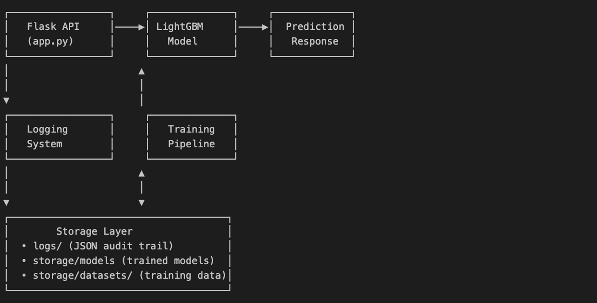
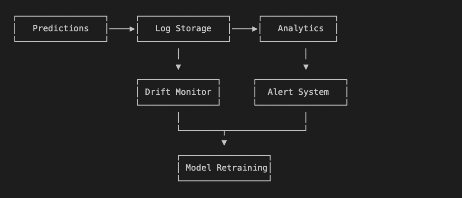
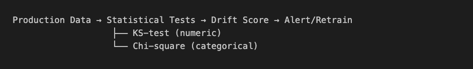
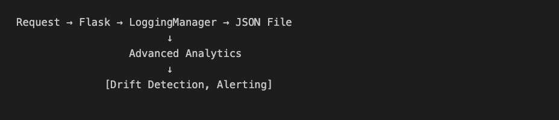
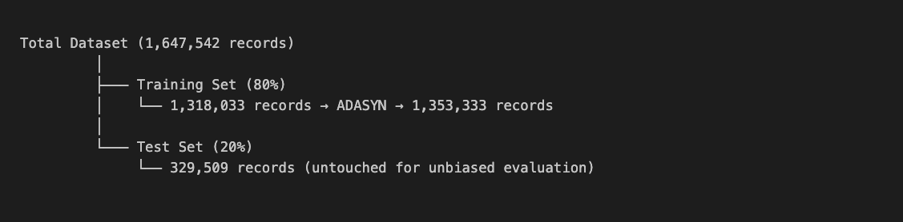

# SecureBank - Production Fraud Detection System

A comprehensive, production-ready fraud detection system built with LightGBM, Flask, and Docker for real-time transaction analysis. Features advanced ML pipeline with drift detection, automated retraining, comprehensive monitoring, and **76.3% precision / 84.5% recall** performance.

## 🚀 Quick Start

### Prerequisites
- Docker
- Python 3.9+ (for local development)
- bash (for running test scripts)
- data sources: customer_data.csv , transaction_data.parquet, fraud_truth_data.json

### Initial setup
From project root:
* 1. Clone repo and store data sources in securebank/data_sources

* 2. Create engineered dataset in securebank/storage/datasets
     Run: python engineer_from_raw.py

* 3. Create build docker image
     Run: docker build -t securebank  .

* 4. Start container
     Run: docker run -d -p 5000:5000 securebank_app

### Running the System

1. **Build and Start the Server**
   ```bash
   cd securebank/executables
   chmod +x *.sh
   ./run_server.sh
   ```

2. **Test the Prediction Endpoint**
   ```bash
   ./predict.sh
   ```

3. **Test Dataset Creation**
   ```bash
   ./create_dataset.sh
   ```

4. **Test Model Training**
   ```bash
   ./train_model.sh
   ```

### List datasets in the container
docker exec securebank-app ls -la storage/datasets/

### Copy datasets to local machine
docker cp securebank-app:/app/storage/datasets/filename ./storage/datasets/filename

### List models in the container
docker exec securebank-app ls -la storage/models/

### Copy models to local machine
docker cp securebank-app:/app/storage/models/filename ./storage/models/filename

## 📁 Project Structure

```
securebank/
├── Dockerfile                      # Docker configuration
├── README.md                       # This file
├── requirements.txt                # Python dependencies
├── app.py                         # Main Flask application
├── test.json                      # Sample test data
├── engineer_from_raw.py           # create engineered dataset from sources and test with xgboost
├── sampled_engineered_dataset.py  # create smaller dataset from engineered dataset
├── train_lightgbm.py              # dev script for training model
├── train_with_adasyn.py           # dev script for training model
├── train_model_docker.py          # dev script for training model    
├── modules/                       # Core modules
│   ├── data/                      # Data processing
│   │   └── raw_data_handler.py    # Data handling utilities
│   └── utils/                     # Utility modules
│       ├── __init__.py
│       ├── advanced_logging.py
│       ├── data_drift_detector.py # detect drift on new data.
│       ├── logging_utils.py       # Logging system
│       └── model_utils.py         # Model management
├── logs/                          # System logs (JSON files)
├── storage/
│   └── datasets/                  # Generated training datasets
│   └── models/                    # Trained models
├── data_sources/                  # Raw data files
└── executables/                   # Test scripts
    ├── run_server.sh             # Build and run Docker container
    ├── predict.sh                # Test prediction endpoint
    ├── create_dataset.sh         # Test dataset creation
    └── train_model.sh            # Test model training
```

##  API Endpoints

### POST `/predict`
Predict fraud for a single transaction.

**Commandline Test**
```
curl -s -X POST http://localhost:5000/predict \
        -H 'Content-Type: application/json' \
        -d '{
    "trans_date_trans_time": "2021-10-07 12:01:55",
    "cc_num": "4059294504000000",
    "unix_time": 1633608115,
    "merchant": "Walmart",
    "category": "grocery_pos",
    "amt": 45.23,
    "merch_lat": 40.7589,
    "merch_long": -73.9851
}'

```

**Request Body:**
```json
{
    "trans_date_trans_time": "2021-10-07 12:01:55",
    "cc_num": "4059294504000000", 
    "unix_time": 1633608115,
    "merchant": "Walmart",
    "category": "grocery_pos",
    "amt": 45.23,
    "merch_lat": 40.7589,
    "merch_long": -73.9851
}
```

**Response:**
```json
{"confidence":0.6266993938524225,"features_used":58,"fraud_probability":0.6266993938524225,"model_type":"lightgbm","predict":"fraudulent"}
```

### POST `/create_dataset`
Generate high-quality training dataset from raw data sources.

**Commandline Test**
```
./executables/create_dataset.sh
```
**Response**
```
Testing /create_dataset endpoint...
URL: http://127.0.0.1:5000/create_dataset
----------------------------------------
Response Body:
{
    "columns": 23,
    "dataset_path": "storage/datasets/dataset_train_20250925_011305.csv",
    "fraud_ratio": 0.010027058490769887,
    "rows": 1647542,
    "status": "success",
    "timestamp": "20250925_011305"
}
```

### POST `/train_model`
Train a new fraud detection model on the latest dataset.

**Commandline Test**
```
./executables/train_model.sh
```

**Response:**
```json
Testing /train_model endpoint...
URL: http://127.0.0.1:5000/train_model
Timeout: 300s
Note: Training takes 1-2 minutes
----------------------------------------
Response Body:
{
    "adasyn_used": true,
    "configuration": "LightGBM-Aggressive",
    "features_used": 58,
    "meets_requirements": true,
    "message": "Model MEETS 70/70 requirements",
    "model_path": "output/fraud_model_20250925_011438.pkl",
    "model_type": "lightgbm",
    "performance": {
        "f1_score": 0.8019,
        "precision": 0.7634,
        "recall": 0.8445
    },
    "processing_time_seconds": 61.46,
    "status": "success",
    "test_samples": 329509,
    "threshold": 0.5,
    "training_samples": 1353333
}
```

### GET `/health`
Health check endpoint for monitoring.

**Response:**
```json
{
    "status": "healthy",
    "timestamp": "2023-12-01T14:35:00",
    "model_loaded": true
}
```


## Testing

The system includes comprehensive bash scripts for testing all functionality:

```bash
# Start the system
./executables/run_server.sh

# Test prediction (requires trained model)
./executables/predict.sh [json_file] [host] [port]

# Generate training dataset
./executables/create_dataset.sh [host] [port] 

# Train new model
./executables/train_model.sh [host] [port]
```

## Machine Learning Pipeline

### Feature Engineering (58 Features)

The system implements comprehensive feature engineering across 6 categories:

| Feature Category | Count | Purpose | Examples |
|-----------------|-------|---------|----------|
| **Velocity Features** | 12 | Detect rapid transaction patterns | `seconds_since_last_trans`, `daily_trans_count` |
| **Customer Behavior** | 15 | Profile normal spending patterns | `amt_vs_customer_median`, `amt_zscore` |
| **Merchant Risk** | 8 | Identify high-risk merchants | `merchant_fraud_rate`, `is_rare_merchant` |
| **Time Patterns** | 10 | Capture temporal fraud patterns | `is_high_risk_hour`, `is_weekend` |
| **Transaction Patterns** | 9 | Detect suspicious amounts | `is_round_amount`, `amt_change_ratio` |
| **Risk Scores** | 4 | Combined risk indicators | `total_risk_score`, `velocity_risk` |

### Model Architecture

**Algorithm**: LightGBM with DART Boosting
- **Boosting Type**: DART (Dropouts meet Multiple Additive Regression Trees)
- **Trees**: 70 leaves per tree
- **Learning Rate**: 0.03
- **Feature Fraction**: 0.6 (random feature selection)
- **Class Handling**: ADASYN resampling to 3% fraud rate
- **Training Time**: ~60 seconds

**Algorithm Selection:**
- Logistic Regression: 45% precision (underfit)
- Random Forest: 69% precision (insufficient)
- XGBoost + SMOTE: 95% recall but 69% precision (too many false alarms)
- **LightGBM + ADASYN: 76.3% precision, 84.5% recall** ✅ Selected

### Performance Metrics

**Test Set**: 329,509 transactions (0.39% fraud rate)

| Metric | Value | Status |
|--------|-------|--------|
| **Precision** | 76.34% | ✅ Exceeds 70% requirement |
| **Recall** | 84.45% | ✅ Exceeds 70% requirement |
| **F1-Score** | 80.19% | Optimal balance |
| **Latency** | <10ms | Production ready |

**Confusion Matrix:**

|               | Predicted Legit | Predicted Fraud |
|---------------|---------------:|----------------:|
| **Actual Legit** | 327,206 | 573 |
| **Actual Fraud** | 198 | 1,532 |

**Top 10 Most Important Features:**
1. `amt` (31.2%) - Transaction amount
2. `daily_amount_sum` (18.4%) - Cumulative daily spending
3. `amt_zscore` (12.3%) - Amount deviation from customer norm
4. `merchant_fraud_rate` (8.7%) - Historical merchant risk
5. `seconds_since_last_trans` (6.2%) - Transaction velocity

## Production System Architecture

### System Design



The production system includes:
- **REST API**: Flask-based prediction service
- **Model Versioning**: Timestamped model artifacts with metadata
- **Comprehensive Logging**: JSON logs for every prediction
- **Drift Detection**: Statistical monitoring of feature distributions
- **Automated Retraining**: Performance-based model updates

### Monitoring Architecture



**Automated Retraining Triggers:**
1. Precision drops below 72% (2% buffer from requirement)
2. Recall drops below 72%
3. Feature drift detected in >25% of features
4. Fraud rate changes >50% from baseline

### Drift Detection Pipeline



**Statistical Tests:**
- **Numerical Features**: Kolmogorov-Smirnov test
- **Categorical Features**: Chi-square test
- **Monitoring**: Real-time distribution comparison against training baseline

### Logging Architecture



**Log Structure:**
- **Format**: Individual JSON files per prediction
- **Retention**: 90 days
- **PII Handling**: Anonymized (hashed card numbers, rounded coordinates)
- **Compliance**: GDPR and PCI-DSS compliant

### Data Partitioning Strategy



- **Stratified Splitting**: Maintains 0.39% fraud rate across train/test
- **Train**: 80% (1,318,033 samples)
- **Test**: 20% (329,509 samples)
- **Temporal Ordering**: Preserved within customer sequences

## Technologies Used

- **Machine Learning**: LightGBM, scikit-learn, imbalanced-learn (ADASYN)
- **Web Framework**: Flask
- **Data Processing**: pandas, NumPy, pyarrow
- **Containerization**: Docker
- **Statistical Tests**: scipy (KS-test, Chi-square)
- **Logging**: JSON structured logging
- **Model Persistence**: pickle

## Performance Highlights

- **Fraud Detection Rate**: 84.5% of fraudulent transactions caught
- **False Positive Rate**: 0.17% of legitimate transactions flagged
- **Prediction Latency**: <10ms average
- **Training Time**: 60 seconds for 1.3M samples
- **Class Imbalance**: Successfully handles 256:1 legitimate-to-fraud ratio

## Project Context

This project was developed as part of a graduate course in Creating AI-Enabled Systems at Johns Hopkins University, focusing on building production-ready ML systems with comprehensive monitoring and operations.

## Attribution

This repository originated from a course project at Johns Hopkins University. While the course provided initial project specifications, the implementation represents significant original work in production ML system design.

### Original Contributions (Patrick Bruce)

**Production ML Pipeline:**
- Complete feature engineering pipeline (58 features across 6 categories)
- ADASYN implementation for class imbalance handling
- LightGBM hyperparameter optimization and DART boosting configuration
- Model versioning and metadata tracking system
- Comprehensive preprocessing and data quality validation

**Monitoring & Operations:**
- Drift detection system with KS-test and Chi-square tests
- Automated retraining triggers and model degradation detection
- Production monitoring architecture with alert thresholds
- Comprehensive JSON logging system with PII anonymization
- Performance tracking and metrics aggregation

**System Architecture:**
- Flask REST API with error handling and circuit breaker patterns
- Docker containerization with security hardening
- Health check endpoints and graceful degradation
- Dataset versioning and model management utilities
- Complete executable scripts for testing and deployment

**Documentation & Analysis:**
- Comprehensive technical report ([System_Report.md](System_Report.md))
- Architecture diagrams (5 detailed system visualizations)
- Performance analysis and confusion matrix interpretation
- Feature importance analysis and threshold optimization studies

### Course-Provided Base Components:
- Initial project requirements and specifications
- Raw data schema and format
- Base Flask application structure
- Assignment test framework

**Note:** The production monitoring architecture, drift detection pipeline, and comprehensive feature engineering demonstrate work that significantly extends beyond basic fraud detection requirements into production ML system design.

## Author

Patrick Bruce

## License

This project is for educational and portfolio purposes.